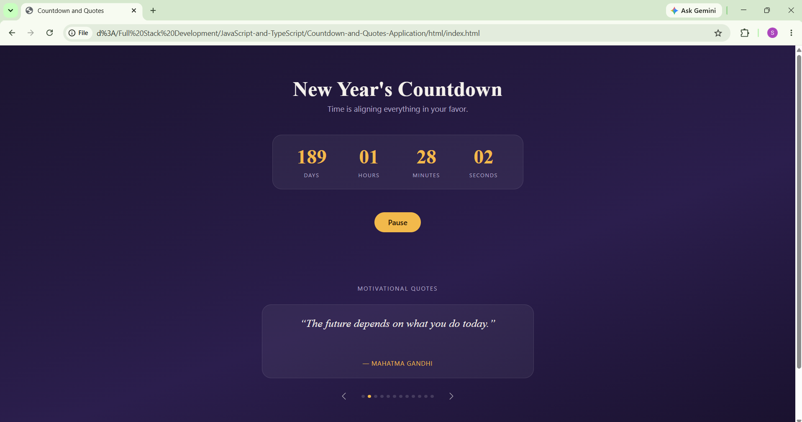
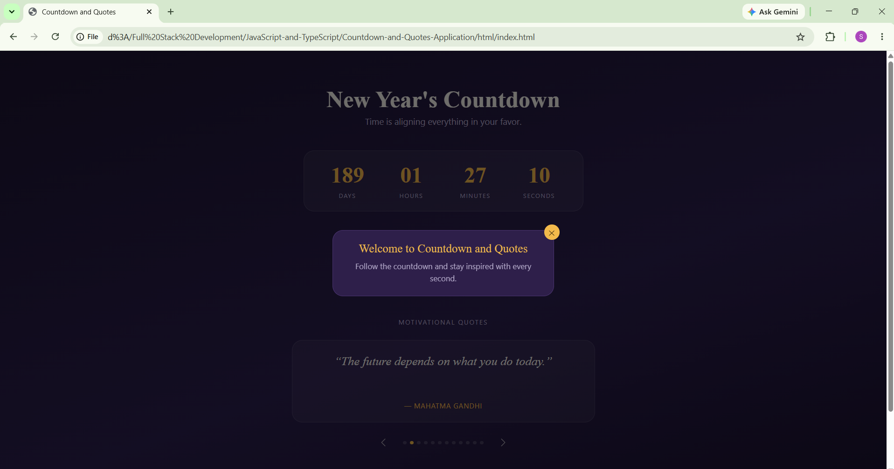

# ⏳ Countdown & Quotes Application

A simple and interactive JavaScript application that combines a **New Year Countdown Timer**, **Motivational Quotes Slider**, and a **Welcome Modal Popup**. This project demonstrates the use of JavaScript timing functions, DOM manipulation, arrays, and ES6 features to create a dynamic user experience.

---

## 📌 Project Description

The Countdown & Quotes Application is built using **HTML**, **CSS**, and **JavaScript**. It displays a live countdown to the New Year, automatically changes motivational quotes, and shows a welcome modal popup after a few seconds of page load.

This project is designed to strengthen JavaScript fundamentals through practical implementation of timers, event handling, and dynamic content updates.

---

## ✨ Features

- ⏳ Real-Time New Year Countdown
- ▶️ Start & Pause Countdown Controls
- 💬 Automatic Motivational Quotes Slider
- ⬅️ Previous & Next Quote Navigation
- 🖼️ Welcome Modal Popup
- 🎯 Dynamic DOM Manipulation
- 📱 Responsive User Interface

---

## 🛠️ Technologies Used

- HTML5
- CSS3
- JavaScript (ES6)

---

## 📚 JavaScript Concepts Covered

- Arrays
- Loops
- Functions
- Arrow Functions
- Template Literals
- DOM Manipulation
- Event Listeners
- Conditional Statements
- setTimeout()
- setInterval()
- clearInterval()

---

## ⚙️ How It Works

### ⏳ Countdown Timer

- Counts down to the New Year.
- Updates every second using `setInterval()`.
- Automatically stops when the countdown reaches zero using `clearInterval()`.
- Displays a celebration message when the countdown ends.

### 💬 Quotes Slider

- Stores motivational quotes in an array.
- Automatically changes quotes every few seconds.
- Includes Previous and Next buttons for manual navigation.

### 🖼️ Welcome Modal

- Appears 5 seconds after the page loads.
- Displays a welcome message.
- Can be closed using the close button.

---

## 📂 Project Structure

```text
Countdown-and-Quotes-Application/
│
├── assets/
│   ├── countdown-and-quotes.png
│   ├── modal.png
|   └── output-video.mp4
│
├── css/
│   └── style.css
│
├── html/
│   └── index.html
│
├── js/
│   └── script.js
│
└── README.md
```

---

## 🚀 Live Demo

👉 **Live Project:**  
Add your Vercel or Netlify deployment link here.

---

## 🎥 Project Explanation Video

👉 **Video:**  
[Project Explanation Video](https://drive.google.com/file/d/1h1eMSsq1PKSahmSxqe9UPNr8LAyeQVb0/view?usp=sharing)

---

## 📸 Screenshots

### ⏳ Countdown Timer & 💬 Quotes Slider



### 🖼️ Welcome Modal



## 🎥 Project Demo

[]((https://drive.google.com/file/d/1aYkrJYBqudBTnPFALE_0Qgq4PagPQ8fR/view?usp=sharing))

---

## 👩‍💻 Author

**Sakina Sendhi**

GitHub: https://github.com/sakinasendhi52

---

## ⭐ Support

If you found this project helpful, please consider giving it a ⭐ on GitHub.

Thank you for visiting this repository!
````
